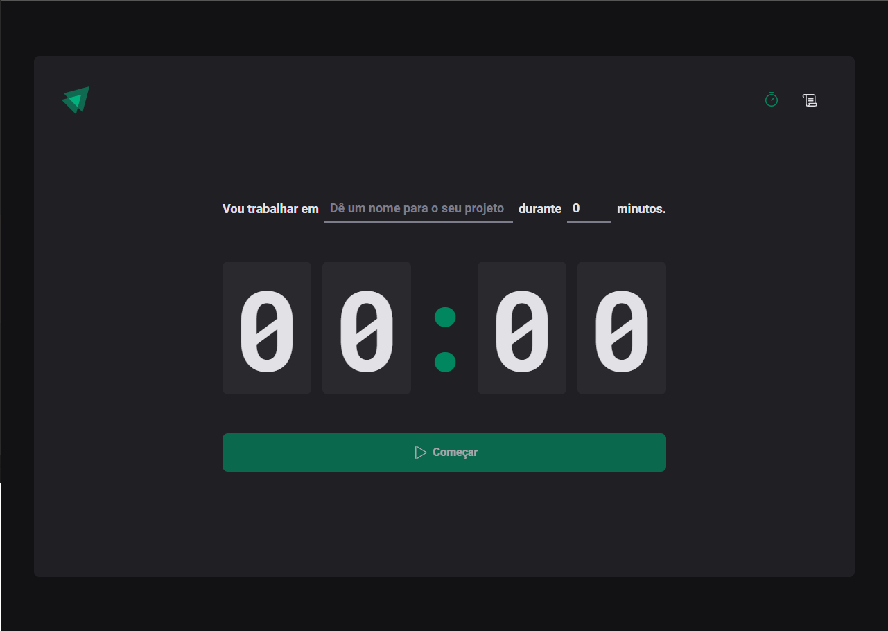

# Projeto Pomodoro Timer - Ignite Rockeseat 

  

- Projeto de um timer com a famosa tecnica pomodoro

## Tecnologias 
- React (Vite)
- Typescripts
- Phosphor React
- Styled-Components

## O que aprendi ?

- Aprendi a utilizar os estados, sobre comunicação entre componentes, conceito de imutabilidade, Styled-Components.
